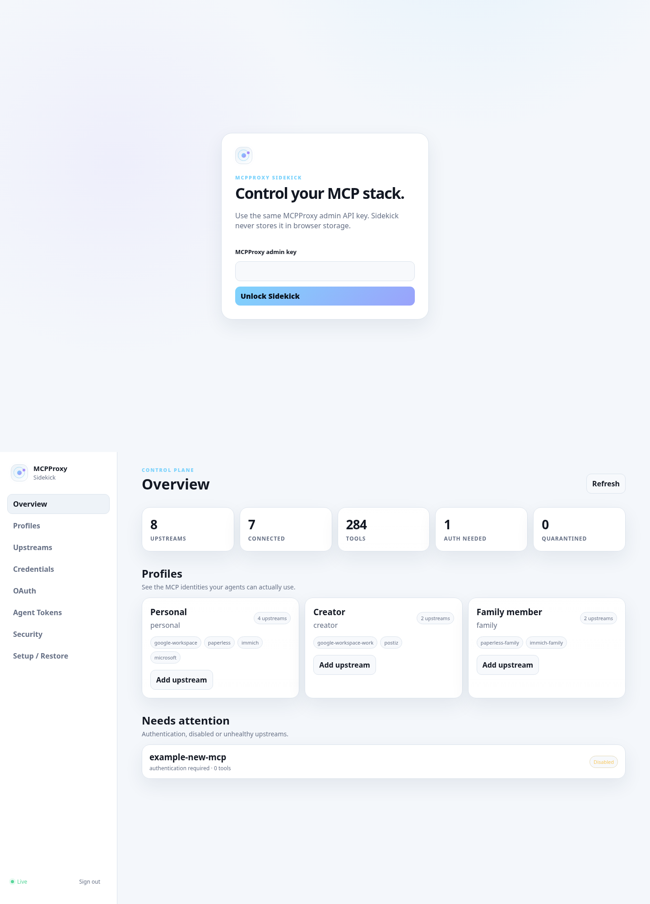

  

<h1 align="center">MCPProxy Sidekick</h1>

<strong>A small control plane for MCPProxy credentials, OAuth, profiles and scoped agent access.</strong> 
Keep MCPProxy as the gateway — make the human parts easier to operate and rebuild.

  
  
  
  

🇬🇧 English · 🇫🇷 <a href="README.fr.md">Français</a> · 🇨🇳 <a href="README.zh-CN.md">简体中文</a>

Sidekick sits next to an existing MCPProxy instance and gives you one browser UI for the parts that otherwise end up scattered across config files, terminals and OAuth callbacks: **credentials, OAuth, profiles, upstream health and Agent Tokens**.

It does not replace MCPProxy. MCPProxy remains the source of truth for routing, tool discovery, upstream state and scoped access.

## ✨ Why Sidekick

- **Dynamic upstream inventory** — add a new MCP server to MCPProxy and it appears automatically.
- **Credential state you can actually see** — configured secrets show a masked preview such as <code>abcd••••wxyz</code>; full values are never returned by Sidekick.
- **Generic credential editor** — Bearer, <code>X-API-Key</code> or a custom header for ordinary MCP servers.
- **Special adapters where generic auth is not enough** — Postiz URL keys, Paperless identity aliases and per-process Immich keys.
- **OAuth that gives you somewhere to click** — a visible browser tab opens immediately. Loopback-bound providers use the protected Cloud browser.
- **Profiles** — group upstreams by identity, role or project.
- **MCPProxy Agent Tokens** — scope agents to named upstreams and read / write / destructive permission tiers, including MCPProxy <code>profile_pin</code>.
- **Rebuildable** — Go binary + Docker Compose + OAuth browser. No laptop-specific tunnel or helper.
- **Small trust surface** — no Docker socket, no CDN JavaScript, non-root container, read-only root filesystem.

## 🚀 Quick start

Sidekick expects an **already-running MCPProxy container**. By default that container is named <code>mcpproxy</code>.

~~~bash
git clone https://github.com/GodsQuantum/mcpproxy-sidekick.git
cd mcpproxy-sidekick

cp .env.example .env
mkdir -p secrets/immich

printf '%s\n' 'YOUR_MCPPROXY_ADMIN_KEY' > secrets/mcpproxy_admin_key
chmod 600 secrets/mcpproxy_admin_key

docker compose up -d
~~~

Then route:

- <code>/control/</code> → Sidekick on port 8081 inside the MCPProxy network namespace;
- <code>/oauth-browser/</code> → Chromium/Selkies on port 3000, protected by Sidekick <code>/auth/check</code>;
- everything else → MCPProxy.

A reference Caddy configuration is included in [Caddyfile.example](Caddyfile.example).

> Sidekick deliberately does **not** publish its own host port in the default Compose. It shares the MCPProxy container network namespace so loopback OAuth callbacks stay on the correct machine.

## 🧩 What the UI manages

### Upstreams

Sidekick reads the live MCPProxy inventory instead of keeping a second server list.

For every upstream it shows enabled state, health/auth state, tool count, transport, quarantine state, profile membership, OAuth/API-key auth and masked credential state.

### Credentials

Ordinary upstreams can use Bearer, X-API-Key or a custom header.

Some MCPs need a different shape. Sidekick includes adapters for:

- **Postiz** — key embedded into its MCP endpoint URL;
- **Paperless MCP** — several MCPProxy aliases can point to one Paperless bridge with different user tokens;
- **ImmichMCP** — each identity can write to a distinct API-key file used by its own ImmichMCP process.

Optional adapter endpoints are configured through <code>.env</code>; private values never belong in Git.

### OAuth

MCPProxy upstream OAuth sometimes requires a callback on the MCPProxy machine's loopback address.

~~~text
your browser
    │
    └── /oauth-browser/
           │
           ▼
     protected Chromium
     in MCPProxy network namespace
           │
           └── provider login → loopback callback → MCPProxy
~~~

Your client machine needs no SSH tunnel, callback daemon or local helper.

Connectors with their own clean remote OAuth/device-code flow can still use that native flow instead.

## 👥 Profiles

Profiles are a human-friendly grouping layer:

~~~text
Personal
  Google Workspace
  Paperless
  Immich
  Microsoft

Creator
  Google Workspace
  Postiz

Family member
  Paperless
  Immich
~~~

The public demo uses generic labels only. Your production profile names stay in Sidekick's local SQLite database.

## 🪪 Agent Tokens

MCPProxy Agent Tokens are the enforcement layer. Sidekick can create tokens with exact allowed servers, read/write/destructive permission tiers, expiry and optional MCPProxy profile pinning.

A destructive token requires explicit confirmation in the UI.

The token secret is shown **once**, exactly as MCPProxy returns it. Sidekick does not store a recoverable copy.

## 🔐 Security model

Sidekick is an **administrative UI** for MCPProxy. Treat access to it as privileged.

- admin key is read server-side from a mounted secret file;
- browser login uses an HttpOnly, Secure, SameSite session cookie;
- state-changing requests require CSRF + trusted Origin/Host;
- CSP blocks remote scripts;
- credential request bodies are never logged;
- full secrets are never returned by Sidekick after submission;
- SQLite stores only metadata, masked previews and SHA-256 fingerprints;
- OAuth browser requires an authenticated Sidekick session;
- no Docker socket;
- non-root runtime;
- read-only root filesystem;
- all Linux capabilities dropped;
- no-new-privileges.

Put the public routes behind HTTPS and your normal authenticated reverse-proxy policy. See [SECURITY.md](SECURITY.md).

## 🐳 Container layout

~~~text
existing MCPProxy container network namespace
│
├── :8080  MCPProxy
├── :8081  MCPProxy Sidekick
├── :3000  OAuth browser UI
└── :9222  Chromium CDP, loopback only
~~~

The base public Compose starts only Sidekick and the OAuth browser. Your MCP servers remain separate; Sidekick controls them through MCPProxy rather than owning their lifecycle.

## ♻️ Restore

Sidekick intentionally stores no recoverable credential vault.

1. restore/start MCPProxy;
2. clone Sidekick;
3. recreate <code>secrets/mcpproxy_admin_key</code>;
4. restore Sidekick's optional data volume if you want profile labels and masked metadata;
5. run <code>docker compose up -d</code>;
6. reconnect credentials/OAuth that are not already persisted by MCPProxy/upstream volumes.

Even without Sidekick's SQLite file, MCPProxy remains authoritative for its server inventory.

## ⚙️ Configuration

| Variable | Default | Purpose |
|---|---|---|
| MCPPROXY_CONTAINER_NAME | mcpproxy | Existing container whose network namespace Sidekick joins. |
| SIDEKICK_MCPPROXY_CONFIG_FILE | empty | Optional read-only MCPProxy JSON config; Sidekick can read its `api_key` directly instead of using a separate key file. |
| SIDEKICK_PUBLIC_BASE_URL | https://mcp.example.com/control/ | Public control-panel URL. |
| SIDEKICK_ALLOWED_HOSTS | mcp.example.com | Trusted browser Host/Origin values. |
| SIDEKICK_SESSION_LIFETIME | 720h | Admin session lifetime. |
| SIDEKICK_POSTIZ_BASE_URL | empty | Optional Postiz MCP base URL for URL-key auth. |
| SIDEKICK_PAPERLESS_ENDPOINT | empty | Optional shared Paperless MCP endpoint. |
| SIDEKICK_OMNIROUTE_DB | empty | Optional read-only OmniRoute SQLite path used to restore the active Master key. |
| PUID / PGID | 1000 / 1000 | LinuxServer Chromium profile ownership. |
| TZ | UTC | OAuth browser timezone. |

## 🧪 Development

~~~bash
go test ./...
go test -race ./...
go vet ./...
node --check internal/web/assets/app.js
podman build -t mcpproxy-sidekick:dev .
~~~

Demo mode serves deterministic fake data and never connects to MCPProxy:

~~~bash
podman run --rm -p 8081:8081 \
  -e SIDEKICK_DEMO_MODE=true \
  mcpproxy-sidekick:dev
~~~

Open http://127.0.0.1:8081. The README screenshot is captured from this demo mode, not from a private installation.

## 🧭 Design rule

> **MCPProxy owns MCP state. Sidekick makes it operable.**

Sidekick avoids becoming a second proxy, a second credential vault or a second copy of the MCP catalog.

## 🤝 Contributing

Issues and pull requests are welcome. For auth/security changes, include tests proving that full secrets cannot appear in API responses or logs.

## 📄 License

[MIT](LICENSE)
