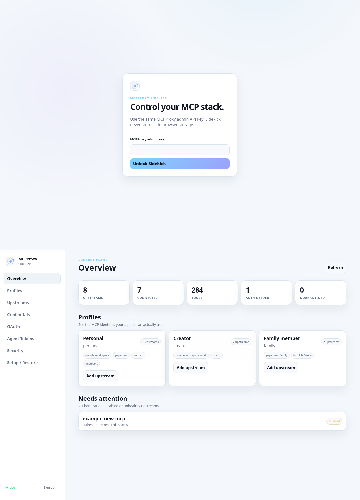

  

<h1 align="center">MCPProxy Sidekick</h1>

<strong>A small control plane for MCPProxy credentials, OAuth, profiles and scoped agent access.</strong> 
Keep MCPProxy as the gateway — make the human parts easier to operate and rebuild.

  
  
  
  

🇬🇧 English · 🇫🇷 <a href="README.fr.md">Français</a> · 🇨🇳 <a href="README.zh-CN.md">简体中文</a>

Sidekick sits next to an existing MCPProxy instance and gives you one browser UI for the parts that otherwise end up scattered across config files, terminals and OAuth callbacks: **Connections, credentials, OAuth scopes, Profiles, agent onboarding and live operational state**.

It does not replace MCPProxy. MCPProxy remains the source of truth for routing, tool discovery, upstream state and scoped access. Sidekick V2 supports MCPProxy **v0.69.0+** and capability-gates newer MCPProxy features at runtime.

Operational details, browser switching and rollback are documented in [Sidekick V2 Operations](docs/sidekick-v2-operations.md).

## ✨ Why Sidekick

- **Connections-first UI** — upstream health, credentials, OAuth, tools and Profile membership live in one place.
- **Credential state you can actually see** — configured secrets show only a masked preview; full values are never returned by Sidekick.
- **Safe OAuth scope editing** — preview the scope diff, validate/apply through MCPProxy, then reconnect only when re-consent is required.
- **Chromium or Brave Human Auth Browser** — choose at install time or switch later with health-checked automatic rollback.
- **Bitwarden-ready** — optional official managed extension policy, including a self-hosted HTTPS vault base URL, without storing vault secrets in Sidekick.
- **Profiles and Agents** — native MCPProxy Profiles, capability-gated newer policy controls, and profile-pinned Agent Tokens through a Give to an agent flow.
- **Live operational state** — authenticated SSE with payload redaction, reconnect backoff and visibility-aware polling fallback.
- **Special adapters where generic auth is not enough** — Postiz URL keys, Paperless identity aliases, per-process Immich keys, optional `openalex-github` API-key files that stay disabled after credential writes, upstream-managed YouTube OAuth, and opt-in secure credential handoff for deployment-defined Crypto.com/Dify integrations.
- **Small trust surface** — no Docker socket, no public CDP, no CDN JavaScript, read-only root filesystem and dropped Linux capabilities.

## 🚀 Quick start

Sidekick expects an **already-running MCPProxy v0.69.0+ container**. By default that container is named <code>mcpproxy</code>.

~~~bash
git clone https://github.com/GodsQuantum/mcpproxy-sidekick.git
cd mcpproxy-sidekick

cp .env.example .env
mkdir -p secrets/immich

printf '%s\n' 'YOUR_MCPPROXY_ADMIN_KEY' > secrets/mcpproxy_admin_key
chmod 600 secrets/mcpproxy_admin_key

docker compose up -d
~~~

Then route:

- a mount path of your choice (for example <code>/control/</code> or <code>/command/</code>) → Sidekick on port 8081 inside the MCPProxy network namespace;
- <code>/control/oauth-browser/</code> (or the equivalent path under your chosen Sidekick mount) → the selected Chromium/Brave Human Auth Browser through Selkies on port 3000, protected by Sidekick <code>/auth/check</code>;
- everything else → MCPProxy.

The frontend derives its API base from the current mount path, so the Sidekick path is not hard-coded. Set <code>SIDEKICK_PUBLIC_BASE_URL</code> to the same public URL and configure your reverse proxy to strip that prefix before forwarding to Sidekick.

A reference Caddy configuration is included in [Caddyfile.example](Caddyfile.example).

> Sidekick deliberately does **not** publish its own host port in the default Compose. It shares the MCPProxy container network namespace so loopback OAuth callbacks stay on the correct machine.

## 🧩 What the UI manages

### Connections

Sidekick reads the live MCPProxy inventory instead of keeping a second server list, then normalizes each upstream into a Connection.

For every Connection it shows enabled/readiness state, tool count, transport, quarantine state, Profile membership, OAuth/API-key auth and masked credential state. Opening a Connection provides credential actions, OAuth reconnect/scopes, diagnostics and supported MCPProxy actions without exposing raw secrets.

### Credentials

Ordinary upstreams can use Bearer, X-API-Key or a custom header.

Some MCPs need a different shape. Sidekick includes adapters for:

- **Postiz** — key embedded into its MCP endpoint URL;
- **Paperless MCP** — several MCPProxy aliases can point to one Paperless bridge with different user tokens;
- **ImmichMCP** — each identity can write to a distinct API-key file used by its own ImmichMCP process;
- **OpenAlex GitHub fallback** — an upstream named `openalex-github` can write its API key atomically to a local `0600` secret file through `SIDEKICK_OPENALEX_KEY_FILE`. Saving/replacing the key deliberately does **not** enable the upstream, so an official OpenAlex connection can remain primary.

Optional adapter endpoints are configured through <code>.env</code>; private values never belong in Git.

### OAuth

MCPProxy upstream OAuth sometimes requires a callback on the MCPProxy machine's loopback address.

~~~text
your browser
    │
    └── /control/oauth-browser/
           │
           ▼
  protected Human Auth Browser
     in MCPProxy network namespace
           │
           └── provider login → loopback callback → MCPProxy
~~~

Your client machine needs no SSH tunnel, callback daemon or local helper.

If Sidekick and the OAuth browser use a normal Docker bridge instead of sharing the MCPProxy network namespace, Chromium may still bind DevTools to loopback. Set `SIDEKICK_CDP_RELAY_ENABLE=true` on the OAuth browser and point `SIDEKICK_OAUTH_CDP_URL` at `http://<oauth-browser-service>:9223`. The relay helper is versioned separately as `deploy/oauth-browser/cdp-relay.py`; only `90-sidekick-chromium` is mounted into `/custom-cont-init.d`, so helper files and backups cannot be executed accidentally by LinuxServer init.

Connectors with their own clean remote OAuth/device-code flow can still use that native flow instead. For FastMCP/OIDC-proxy interoperability, see [FastMCP OAuth interoperability](docs/fastmcp-oauth.md), including the security constraints around `require_authorization_consent="external"`.

## 👥 Profiles

Profiles are a human-friendly grouping layer:

~~~text
Personal
  Google Workspace
  Paperless
  Immich
  Microsoft

Creator
  Google Workspace
  Postiz

Family member
  Paperless
  Immich
~~~

Profiles are **native MCPProxy v0.69.0+ profiles**. Sidekick reads them from `GET /api/v1/profiles` and applies membership changes through MCPProxy's configuration API; it does not keep a second profile catalog in SQLite. Native routes are `/mcp/p/<name>`.

**Upgrade note from Sidekick ≤ v0.1.8:** legacy SQLite profile tables are no longer a runtime source of truth. They are left untouched rather than silently deleted. Recreate any legacy-only profile in MCPProxy before removing an old Sidekick database.

## 🪪 Agent Tokens

MCPProxy Agent Tokens are the enforcement layer. Sidekick can create tokens with exact allowed servers, read/write/destructive permission tiers, expiry and optional MCPProxy profile pinning.

A destructive token requires explicit confirmation in the UI.

The token secret is shown **once**, exactly as MCPProxy returns it. Sidekick does not store a recoverable copy.

## 🔐 Security model

Sidekick is an **administrative UI** for MCPProxy. Treat access to it as privileged.

- admin key is read server-side from a mounted secret file;
- browser login uses an HttpOnly, Secure, SameSite session cookie;
- state-changing requests require CSRF + trusted Origin/Host;
- CSP blocks remote scripts;
- credential request bodies are never logged;
- full secrets are never returned by Sidekick after submission;
- SQLite stores only metadata, masked previews and SHA-256 fingerprints;
- OAuth browser requires an authenticated Sidekick session;
- no Docker socket;
- non-root runtime;
- read-only root filesystem;
- all Linux capabilities dropped;
- no-new-privileges.

Put the public routes behind HTTPS and your normal authenticated reverse-proxy policy. See [SECURITY.md](SECURITY.md).

## 🐳 Container layout

~~~text
existing MCPProxy container network namespace
│
├── :8080  MCPProxy
├── :8081  MCPProxy Sidekick
├── :3000  Human Auth Browser UI (Chromium or Brave)
└── :9222  Browser CDP, loopback only
~~~

The base public Compose starts only Sidekick and the OAuth browser. Your MCP servers remain separate; Sidekick controls them through MCPProxy rather than owning their lifecycle.

## ♻️ Restore

Sidekick intentionally stores no recoverable credential vault.

1. restore/start MCPProxy;
2. clone Sidekick;
3. recreate <code>secrets/mcpproxy_admin_key</code>;
4. restore Sidekick's optional data volume if you want masked credential metadata; native Profiles are restored with MCPProxy;
5. run <code>docker compose up -d</code>;
6. reconnect credentials/OAuth that are not already persisted by MCPProxy/upstream volumes.

Even without Sidekick's SQLite file, MCPProxy remains authoritative for its server inventory and Profiles.

## ⚙️ Configuration

| Variable | Default | Purpose |
|---|---|---|
| MCPPROXY_CONTAINER_NAME | mcpproxy | Existing container whose network namespace Sidekick joins. |
| SIDEKICK_MCPPROXY_CONFIG_FILE | empty | Optional read-only MCPProxy JSON config; Sidekick can read its `api_key` directly instead of using a separate key file. |
| SIDEKICK_DROP_UID / SIDEKICK_DROP_GID | empty | Optional Linux privilege drop target. Useful with a root-only MCPProxy config: start the container as root, load the config, then immediately drop to this UID/GID before opening SQLite or HTTP. |
| SIDEKICK_PUBLIC_BASE_URL | https://mcp.example.com/control/ | Public control-panel URL. |
| SIDEKICK_MOUNT_PATH | /control | Reverse-proxy mount path. Change this to /command or another prefix if desired. |
| SIDEKICK_ALLOWED_HOSTS | mcp.example.com | Trusted browser Host/Origin values. |
| SIDEKICK_SESSION_LIFETIME | 720h | Admin session lifetime. |
| SIDEKICK_OAUTH_CDP_URL | http://127.0.0.1:9222 | Human Auth Browser DevTools endpoint. With a separate browser network namespace and the relay enabled, use `http://oauth-browser:9223`. |
| SIDEKICK_BROWSER_PROVIDER | chromium | Human Auth Browser provider: `chromium` or `brave`. |
| SIDEKICK_BROWSER_IMAGE | lscr.io/linuxserver/chromium:latest | Browser container image. The guarded switch script updates this with the provider. |
| SIDEKICK_BROWSER_PROFILE_DIR | chromium-sidekick-oauth | Persistent browser profile directory below `/config`. |
| SIDEKICK_BITWARDEN_MODE | off | `off`, `assist`, or `managed-extension`. |
| SIDEKICK_BITWARDEN_BASE_URL | empty | Optional HTTPS base URL for self-hosted Bitwarden/Vaultwarden. No vault credential is stored here. |
| SIDEKICK_CDP_RELAY_ENABLE | false | Opt-in DevTools relay for bridge-network deployments where the browser remains loopback-bound. |
| SIDEKICK_POSTIZ_BASE_URL | empty | Optional Postiz MCP base URL for URL-key auth. |
| SIDEKICK_PAPERLESS_ENDPOINT | empty | Optional shared Paperless MCP endpoint. |
| SIDEKICK_OMNIROUTE_DB | empty | Optional read-only OmniRoute SQLite path used to restore the active Master key. |
| SIDEKICK_OPENALEX_KEY_FILE | empty | Optional write-only secret path used by an upstream named `openalex-github`. Sidekick stores a submitted OpenAlex API key atomically with mode `0600` and does not auto-enable the upstream. |
| SIDEKICK_YOUTUBE_OAUTH_CONTROL_URL | empty | Optional internal helper URL for YouTube MCPs whose Google OAuth is managed inside the upstream process. |
| SIDEKICK_CREDENTIAL_PENDING_HOST_DIR | empty | Optional host-side transient credential inbox used by secure handoff adapters. |
| SIDEKICK_CREDENTIAL_SSH_TRANSFER_ROOT | empty | Optional transfer root reachable by the configured SSH MCP. |
| SIDEKICK_CREDENTIAL_SOURCE_SSH_PROFILE | empty | SSH MCP profile used to stage/remove transient credential files on the Sidekick host. |
| SIDEKICK_CRYPTOCOM_APP_REMOTE_ENV_PATH | empty | Destination 0600 environment file for the Crypto.com Main App Agent Key bridge. |
| SIDEKICK_CRYPTOCOM_APP_REMOTE_COMPOSE_DIR | empty | Remote Compose directory for the Crypto.com Main App MCP service. |
| SIDEKICK_CRYPTOCOM_APP_REMOTE_SERVICE | cryptocom-app | App MCP Compose service force-recreated after App credential rotation. |
| SIDEKICK_CRYPTOCOM_EXCHANGE_REMOTE_ENV_PATH | empty | Separate 0600 environment file for Crypto.com Exchange API credentials. |
| SIDEKICK_CRYPTOCOM_EXCHANGE_REMOTE_COMPOSE_DIR | empty | Remote Compose directory for the Crypto.com Exchange MCP service. |
| SIDEKICK_CRYPTOCOM_EXCHANGE_REMOTE_SERVICE | cryptocom-exchange | Exchange MCP Compose service force-recreated after Exchange credential rotation. |
| SIDEKICK_CRYPTOCOM_REMOTE_USER | empty | Remote OS user that owns both Crypto.com environment files. |
| SIDEKICK_CRYPTOCOM_REMOTE_SSH_PROFILE | empty | SSH MCP profile for the remote Crypto.com gateway host. |

> Crypto.com App and Exchange are intentionally separate credential/account surfaces. The App target writes CDC_API_KEY / CDC_API_SECRET; the Exchange target writes CDCX_API_KEY / CDCX_API_SECRET. Never point both services at the same credential file.

| SIDEKICK_DIFY_REMOTE_SSH_PROFILE | empty | SSH MCP profile for the Dify host when server-side Dify credential application is enabled. |
| SIDEKICK_DIFY_APPLY_HELPER_PATH | empty | Remote helper that writes one-time MCP credentials through Dify's native encrypted provider storage. |
| SIDEKICK_DIFY_BINDINGS_JSON | empty | Optional JSON mapping of MCPProxy profiles to Dify provider IDs and enforced permission lists. |
| PUID / PGID | 1000 / 1000 | LinuxServer Chromium profile ownership. |
| TZ | UTC | OAuth browser timezone. |

## 🧪 Development

~~~bash
go test ./...
go test -race ./...
go vet ./...
node --check internal/web/assets/app.js
podman build -t mcpproxy-sidekick:dev .
~~~

Demo mode serves deterministic fake data and never connects to MCPProxy:

~~~bash
podman run --rm -p 8081:8081 \
  -e SIDEKICK_DEMO_MODE=true \
  mcpproxy-sidekick:dev
~~~

Open http://127.0.0.1:8081. The README screenshot is captured from this demo mode, not from a private installation.

## 🧭 Design rule

> **MCPProxy owns MCP state. Sidekick makes it operable.**

Sidekick avoids becoming a second proxy, a second credential vault or a second copy of the MCP catalog.

## 🤝 Contributing

Issues and pull requests are welcome. For auth/security changes, include tests proving that full secrets cannot appear in API responses or logs.

## 📄 License

[MIT](LICENSE)

## OAuth reconnect resilience

Sidekick reconnects OAuth servers transactionally:

- **Never pre-logout.** Clicking **Reconnect** starts a replacement OAuth flow without deleting the currently stored token first. A temporary network/browser failure therefore cannot turn a recoverable session into a forced logout.
- **Transient retry.** OAuth-start calls tolerate short local/network recovery delays before surfacing an error.
- **CloakBrowser-compatible CDP.** Sidekick keeps Chromium's native PUT /json/new fast path and falls back to the browser-level DevTools WebSocket Target.createTarget command when a CDP relay (such as CloakBrowser Manager) does not expose /json/new.
- **Actionable errors.** Failures are reported by stage (start OAuth session vs open OAuth browser) without logging authorization URLs, tokens or secrets.

For production, keep the upstream MCP server's OAuth/token store on persistent storage. An Internet outage should be handled by reconnect/retry; it should never trigger automatic token deletion.
